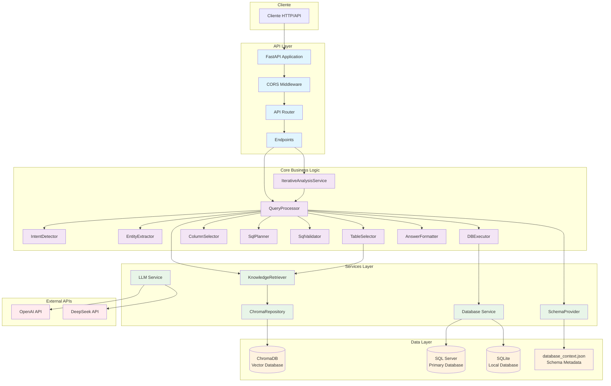
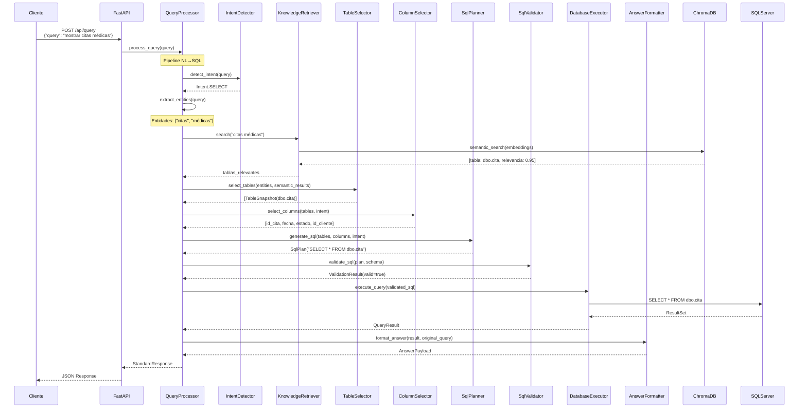
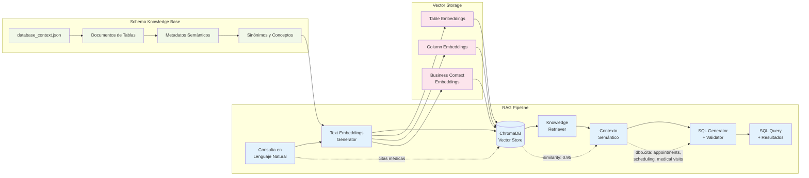
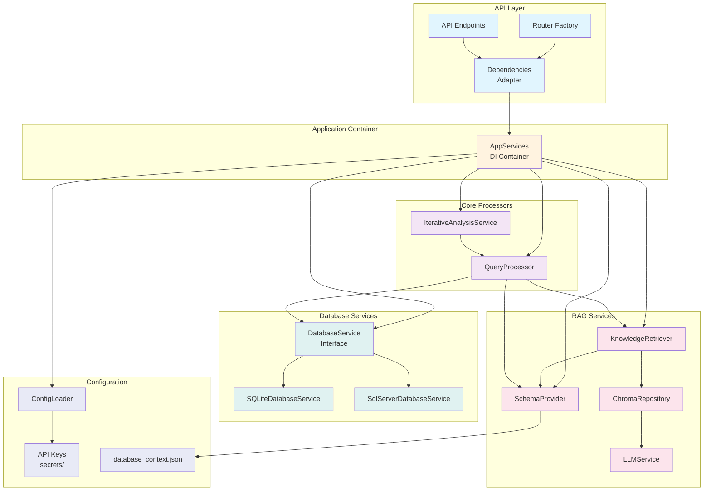
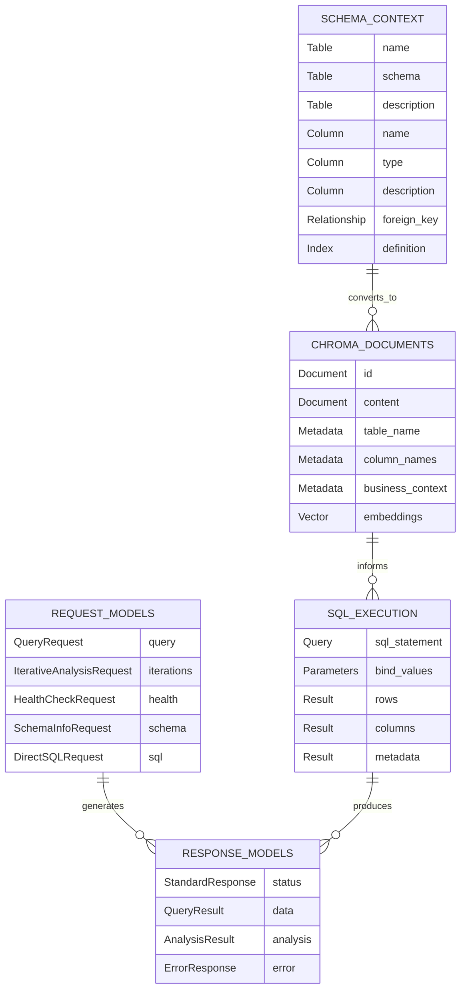
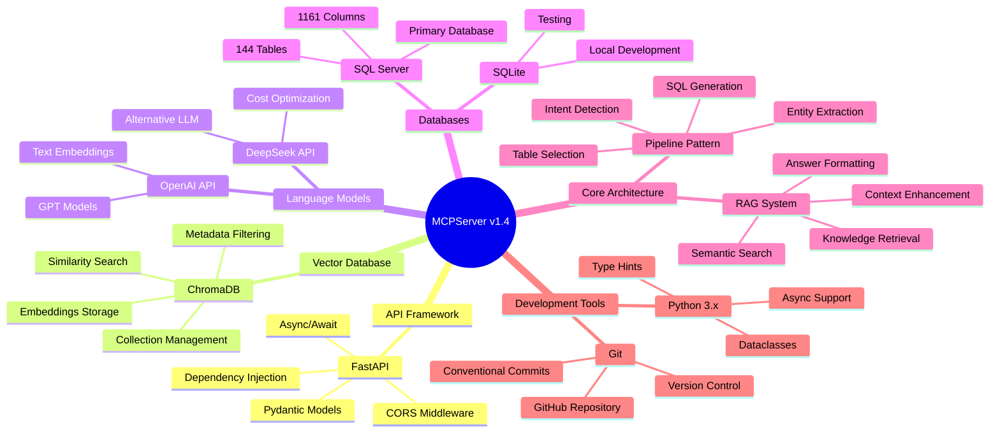

# Diagramas de Arquitectura - MCPServer v1.4

## 1. Arquitectura General del Sistema



## 2. Pipeline de Procesamiento NL→SQL



## 3. Arquitectura RAG (Retrieval-Augmented Generation)



## 4. Estructura de Servicios y Dependencias



## 5. Flujo de Datos del Sistema RAG

```mermaid
flowchart TD
    subgraph "Ingesta de Schema"
        A[database_context.json<br/>144 tablas, 1161 columnas]
        B[SchemaProvider<br/>Convierte a documentos]
        C[Enriquecimiento Semántico<br/>business_context, synonyms]
        D[Generación de Embeddings<br/>OpenAI/DeepSeek]
        E[ChromaDB Storage<br/>Vectores + Metadatos]
    end
    
    subgraph "Procesamiento de Query"
        F[Query NL<br/>"mostrar citas médicas"]
        G[Embedding de Query<br/>Vector representación]
        H[Búsqueda Semántica<br/>Similarity search]
        I[Contexto Recuperado<br/>Tablas + metadatos relevantes]
        J[Generación SQL<br/>Determinística + Validación]
        K[Ejecución en DB<br/>SQL Server/SQLite]
        L[Formateo de Respuesta<br/>JSON estructurado]
    end
    
    subgraph "Retroalimentación"
        M[Análisis de Resultados<br/>Calidad + Relevancia]
        N[Mejora Iterativa<br/>Refinamiento de contexto]
        O[Actualización de Embeddings<br/>Aprendizaje continuo]
    end

    %% Flujo de ingesta
    A --> B
    B --> C
    C --> D
    D --> E
    
    %% Flujo de procesamiento
    F --> G
    G --> H
    H --> I
    I --> J
    J --> K
    K --> L
    
    %% Conexiones entre fases
    E -.-> H
    I --> J
    
    %% Retroalimentación
    L --> M
    M --> N
    N --> O
    O -.-> E
    
    %% Estados de datos
    A -.->|"Ejemplo: tabla 'cita'"| A1[Table: dbo.cita<br/>Columns: id_cita, fecha, estado<br/>Business: Gestión de citas médicas]
    E -.->|"Vector almacenado"| E1[Vector: [0.1, -0.3, 0.7, ...]<br/>Metadata: table=cita, type=appointment]
    I -.->|"Contexto recuperado"| I1[Match: dbo.cita similarity=0.95<br/>Synonyms: appointment, consulta<br/>Related: cliente, servicio]

    classDef ingesta fill:#e8f5e8
    classDef proceso fill:#e3f2fd
    classDef feedback fill:#fff3e0
    classDef ejemplo fill:#f5f5f5
    
    class A,B,C,D,E ingesta
    class F,G,H,I,J,K,L proceso
    class M,N,O feedback
    class A1,E1,I1 ejemplo
```

## 6. Modelo de Datos y Esquemas



## 7. Diagrama de Clases

```mermaid
classDiagram
    %% ===== API LAYER =====
    class FastAPI {
        -app: FastAPI
        -middleware: CORSMiddleware
        +startup()
        +shutdown()
        +include_router()
    }
    
    class APIRouter {
        -prefix: str
        -tags: List[str]
        +get()
        +post()
        +put()
        +delete()
    }
    
    %% ===== REQUEST/RESPONSE MODELS =====
    class QueryRequest {
        +question: str
        +llm_provider: str
    }
    
    class IterativeAnalysisRequest {
        +question: str
        +llm_provider: str
        +max_iterations: int
    }
    
    class DirectSQLRequest {
        +sql: str
    }
    
    class StandardResponse {
        +status: str
        +message: str
        +timestamp: datetime
        +data: Optional[Any]
    }
    
    %% ===== APPLICATION CONTAINER =====
    class AppServices {
        +config: Optional[ConfigLoader]
        +db: Optional[DatabaseService]
        +schema_provider: Optional[SchemaProvider]
        +retriever: Optional[KnowledgeRetriever]
        +query_processor: Optional[QueryProcessor]
        +iterative: Optional[IterativeAnalysisService]
        +llm: Optional[object]
        +initialize()
    }
    
    %% ===== CORE BUSINESS LOGIC =====
    class QueryProcessor {
        -_schema_provider: SchemaProvider
        -_db_service: DatabaseService
        -_retriever: KnowledgeRetriever
        -_detector: IntentDetector
        -_table_selector: TableSelector
        -_column_selector: ColumnSelector
        -_planner: SqlPlanner
        -_validator: SqlValidator
        -_formatter: AnswerFormatter
        +answer_one_shot(question: str): Dict
        +process_query(request: QueryRequest): StandardResponse
        -_snapshots_from_provider(): List[TableSnapshot]
        -_detect_dialect(dialect: str): str
    }
    
    class IntentDetector {
        -_config: IntentDetectionConfig
        +detect(question: str): DetectionResult
        -_normalize_text(text: str): str
        -_compute_scores(text: str): Dict[Intent, float]
    }
    
    class Intent {
        <<enumeration>>
        COUNT
        LIST
        AGGREGATE
        DESCRIBE
        UNKNOWN
    }
    
    class DetectionResult {
        +intent: Intent
        +confidence: float
        +normalized_question: str
        +reasons: List[str]
        +flags: Dict[str, bool]
    }
    
    class TableSelector {
        +select(question: str, tables: List[TableSnapshot]): SelectionResult
        -_score_table(table: TableSnapshot, entities: List): float
        -_apply_semantic_boost(scores: Dict): Dict
    }
    
    class ColumnSelector {
        +select(tables: List[TableSnapshot], intent: Intent): List[str]
        +profile_from_snapshot(snapshot: TableSnapshot): TableProfile
        -_select_by_role(profile: TableProfile): List[str]
    }
    
    class SqlPlanner {
        +generate(tables: List, columns: List, intent: Intent): SqlPlan
        -_build_select_clause(columns: List): str
        -_build_from_clause(tables: List): str
        -_build_where_clause(conditions: List): str
    }
    
    class SqlValidator {
        +validate(plan: SqlPlan, schema: DatabaseSchema): ValidationResult
        -_check_syntax(sql: str): bool
        -_check_tables_exist(tables: List): bool
        -_check_columns_exist(columns: List): bool
    }
    
    %% ===== SCHEMA AND DATA MODELS =====
    class SchemaProvider {
        -_path: str
        -_schema: Optional[DatabaseSchema]
        +load(): void
        +get_schema(): DatabaseSchema
        +to_documents(): List[Document]
        -_table_to_document(table: TableDef): Document
    }
    
    class DatabaseSchema {
        +dialect: str
        +tables: List[TableDef]
    }
    
    class TableDef {
        +name: str
        +schema: str
        +full_name: str
        +columns: List[ColumnDef]
        +description: str
        +business_context: Optional[str]
        +synonyms: Optional[List[str]]
        +related_concepts: Optional[List[str]]
    }
    
    class ColumnDef {
        +name: str
        +type: str
        +nullable: bool
        +pk: bool
        +identity: bool
        +description: str
    }
    
    class TableSnapshot {
        +full_name: str
        +schema: str
        +name: str
        +columns: List[str]
        +description: str
        +selected: bool
        +reason: str
    }
    
    %% ===== RAG SERVICES =====
    class KnowledgeRetriever {
        -_chroma_repo: ChromaRepository
        -_schema_provider: SchemaProvider
        +search(query: str, top_k: int): List[SearchResult]
        +get_table_context(table_name: str): Optional[Dict]
        -_enhance_with_schema(results: List): List
    }
    
    class ChromaRepository {
        -_client: ChromaClient
        -_collection: Collection
        +upsert_documents(documents: List[Document]): void
        +query(query_text: str, n_results: int): QueryResult
        +delete_collection(): void
        +get_collection_info(): Dict
    }
    
    class Document {
        +id: str
        +content: str
        +metadata: Dict[str, Any]
    }
    
    class SearchResult {
        +table_name: str
        +relevance_score: float
        +content: str
        +metadata: Dict[str, Any]
    }
    
    %% ===== DATABASE SERVICES =====
    class DatabaseService {
        <<interface>>
        +connect(): void
        +disconnect(): void
        +fetch_all(sql: str, params: List): List[Dict]
        +get_schema_overview(): Dict
        +test_connection(): bool
    }
    
    class SQLiteDatabaseService {
        -_connection: sqlite3.Connection
        -_db_path: str
        +connect(): void
        +disconnect(): void
        +fetch_all(sql: str, params: List): List[Dict]
        +execute_sql(sql: str): Any
    }
    
    class SqlServerDatabaseService {
        -_connection: pyodbc.Connection
        -_connection_string: str
        +connect(): void
        +disconnect(): void
        +fetch_all(sql: str, params: List): List[Dict]
        +get_tables(): List[str]
        +get_columns(table: str): List[Dict]
    }
    
    %% ===== LLM SERVICES =====
    class LLMService {
        -_provider: str
        -_api_key: str
        -_base_url: str
        +generate_embeddings(text: str): List[float]
        +chat_completion(messages: List): str
        +validate_api_key(): bool
    }
    
    class IterativeAnalysisService {
        -_query_processor: QueryProcessor
        -_max_iterations: int
        +analyze(request: IterativeAnalysisRequest): StandardResponse
        -_refine_query(query: str, previous_result: Dict): str
        -_should_continue(iteration: int, result: Dict): bool
    }
    
    %% ===== UTILITY CLASSES =====
    class ConfigLoader {
        -_config_path: str
        -_config_data: Dict
        +load(): Dict
        +get(key: str, default: Any): Any
        +get_database_config(): Dict
        +get_llm_config(): Dict
    }
    
    %% ===== RELATIONSHIPS =====
    
    %% API Layer
    FastAPI --> APIRouter
    APIRouter --> QueryRequest
    APIRouter --> StandardResponse
    APIRouter --> AppServices
    
    %% Application Container
    AppServices --> QueryProcessor
    AppServices --> SchemaProvider
    AppServices --> KnowledgeRetriever
    AppServices --> DatabaseService
    AppServices --> ConfigLoader
    
    %% Core Business Logic
    QueryProcessor --> IntentDetector
    QueryProcessor --> TableSelector
    QueryProcessor --> ColumnSelector
    QueryProcessor --> SqlPlanner
    QueryProcessor --> SqlValidator
    QueryProcessor --> SchemaProvider
    QueryProcessor --> KnowledgeRetriever
    QueryProcessor --> DatabaseService
    
    IntentDetector --> DetectionResult
    DetectionResult --> Intent
    TableSelector --> TableSnapshot
    
    %% Schema Models
    SchemaProvider --> DatabaseSchema
    DatabaseSchema --> TableDef
    TableDef --> ColumnDef
    SchemaProvider --> Document
    
    %% RAG Services
    KnowledgeRetriever --> ChromaRepository
    KnowledgeRetriever --> SchemaProvider
    ChromaRepository --> Document
    KnowledgeRetriever --> SearchResult
    ChromaRepository --> LLMService
    
    %% Database Services
    DatabaseService <|-- SQLiteDatabaseService
    DatabaseService <|-- SqlServerDatabaseService
    
    %% Iterative Analysis
    IterativeAnalysisService --> QueryProcessor
```



## 8. Tecnologías y Stack



---

## Resumen de la Arquitectura

El **MCPServer v1.4** implementa un sistema **RAG (Retrieval-Augmented Generation)** completo para convertir consultas en lenguaje natural a SQL de manera inteligente y contextual.

### Características Principales:

1. **Pipeline NL→SQL Determinístico**: Flujo robusto desde detección de intención hasta ejecución
2. **RAG Semántico**: Búsqueda vectorial con ChromaDB para encontrar tablas y columnas relevantes
3. **Arquitectura Modular**: Separación clara entre API, lógica de negocio y servicios
4. **Múltiples Bases de Datos**: Soporte para SQL Server y SQLite
5. **Contexto Enriquecido**: 144 tablas con metadatos semánticos y sinónimos
6. **API RESTful**: FastAPI con modelos Pydantic y documentación automática

### Flujo de Procesamiento:

**Consulta NL** → **Embeddings** → **Búsqueda Semántica** → **Selección de Tablas/Columnas** → **Generación SQL** → **Validación** → **Ejecución** → **Formateo de Respuesta**

La arquitectura está diseñada siguiendo los principios de **claridad, modularidad y evolución**, permitiendo extensiones futuras y mantenimiento sencillo.