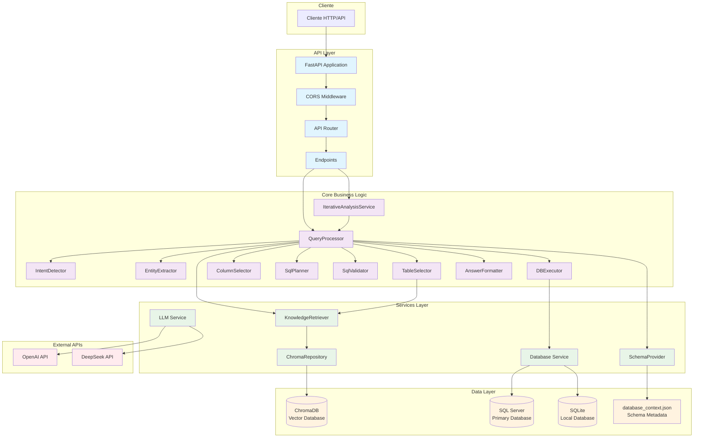
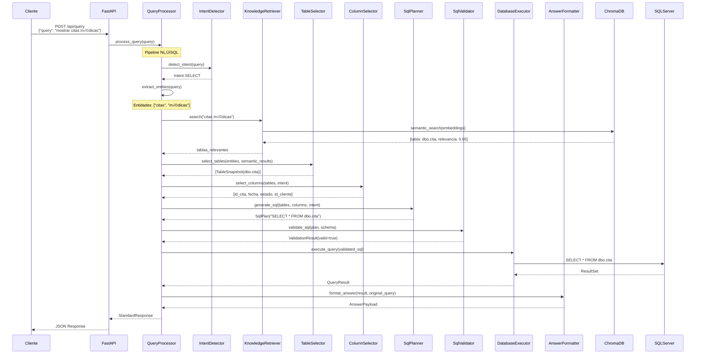
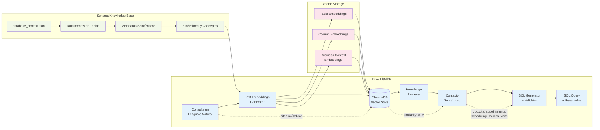
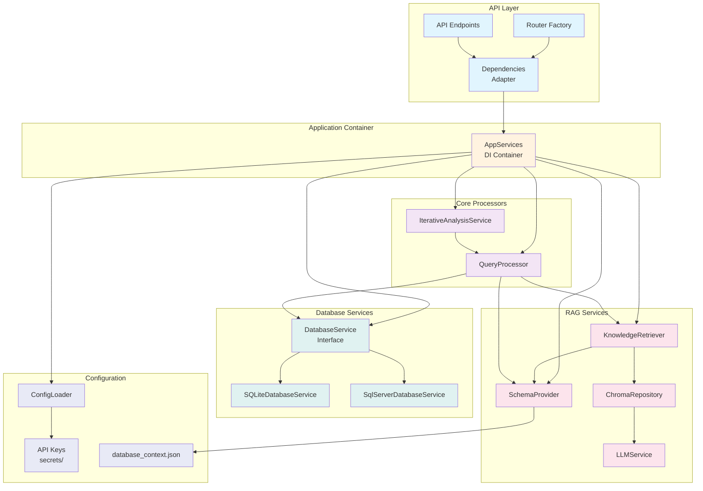
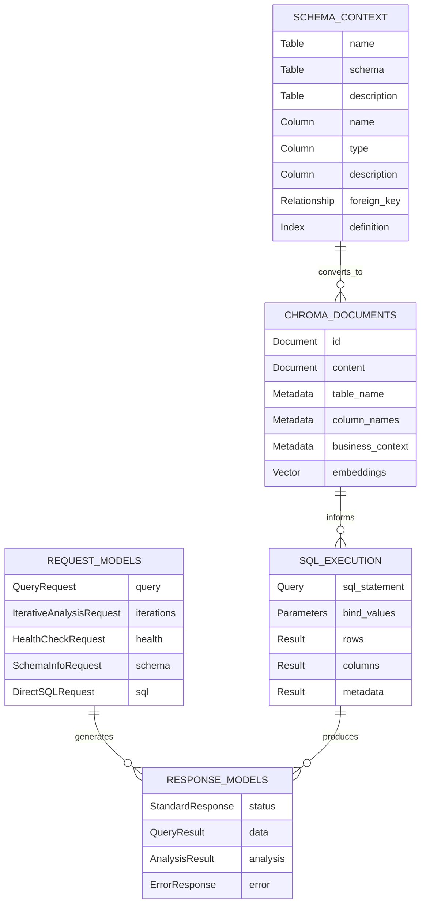
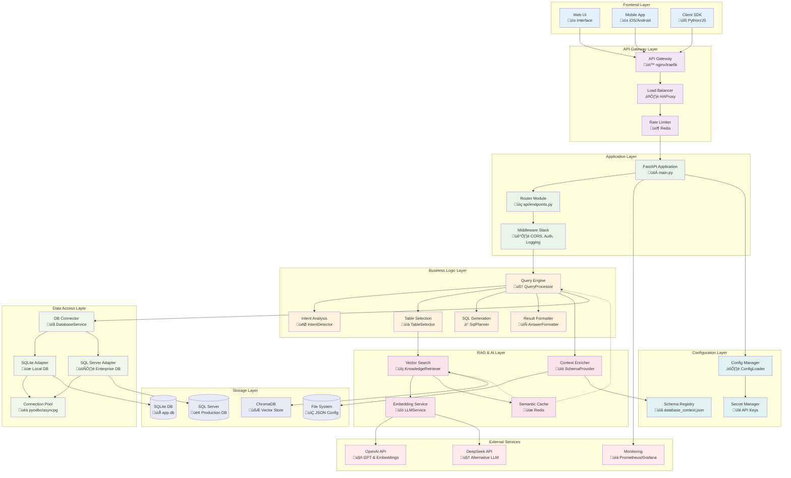
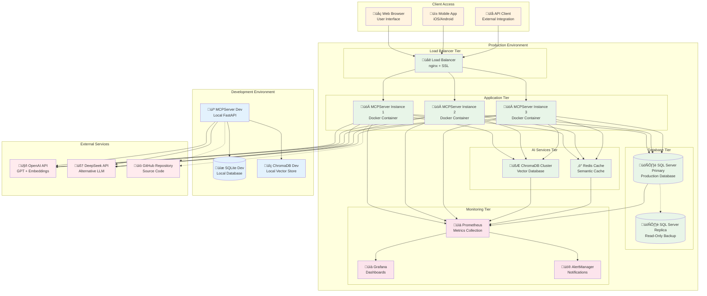
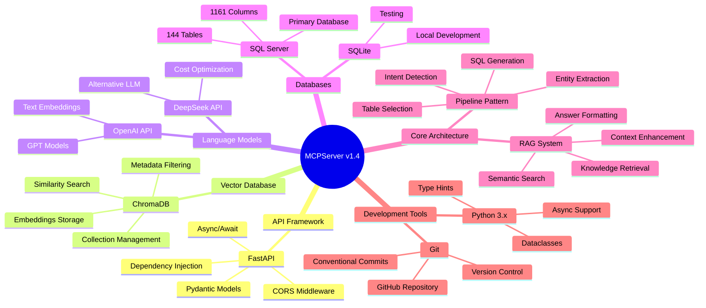

# Diagramas de Arquitectura - MCPServer v1.4

## 1. Arquitectura General del Sistema

```mermaid
graph TB
    subgraph "Cliente"
        Client[Cliente HTTP/API]
    end
    
    subgraph "API Layer"
        FastAPI[FastAPI Application]
        Router[API Router]
        Endpoints[Endpoints]
        Middleware[CORS Middleware]
    end
    
    subgraph "Core Business Logic"
        QP[QueryProcessor]
        IAS[IterativeAnalysisService]
        Intent[IntentDetector]
        Entities[EntityExtractor]
        TableSel[TableSelector]
        ColSel[ColumnSelector]
        SQLPlan[SqlPlanner]
        SQLVal[SqlValidator]
        DBExec[DBExecutor]
        Formatter[AnswerFormatter]
    end
    
    subgraph "Services Layer"
        SchemaProvider[SchemaProvider]
        KnowledgeRetriever[KnowledgeRetriever]
        ChromaRepo[ChromaRepository]
        LLMService[LLM Service]
        DBService[Database Service]
    end
    
    subgraph "Data Layer"
        ChromaDB[(ChromaDB<br/>Vector Database)]
        SQLServer[(SQL Server<br/>Primary Database)]
        SQLite[(SQLite<br/>Local Database)]
        ContextJSON[database_context.json<br/>Schema Metadata]
    end
    
    subgraph "External APIs"
        OpenAI[OpenAI API]
        DeepSeek[DeepSeek API]
    end

    %% Flujo principal
    Client --> FastAPI
    FastAPI --> Middleware
    Middleware --> Router
    Router --> Endpoints
    Endpoints --> QP
    
    %% Pipeline NL‚ÜíSQL
    QP --> Intent
    QP --> Entities
    QP --> TableSel
    QP --> ColSel
    QP --> SQLPlan
    QP --> SQLVal
    QP --> DBExec
    QP --> Formatter
    
    %% Servicios de apoyo
    QP --> SchemaProvider
    QP --> KnowledgeRetriever
    TableSel --> KnowledgeRetriever
    KnowledgeRetriever --> ChromaRepo
    ChromaRepo --> ChromaDB
    
    %% Acceso a datos
    SchemaProvider --> ContextJSON
    DBService --> SQLServer
    DBService --> SQLite
    DBExec --> DBService
    
    %% APIs externas
    LLMService --> OpenAI
    LLMService --> DeepSeek
    
    %% An√°lisis iterativo
    Endpoints --> IAS
    IAS --> QP

    classDef api fill:#e1f5fe
    classDef core fill:#f3e5f5
    classDef service fill:#e8f5e8
    classDef data fill:#fff3e0
    classDef external fill:#ffebee
    
    class FastAPI,Router,Endpoints,Middleware api
    class QP,IAS,Intent,Entities,TableSel,ColSel,SQLPlan,SQLVal,DBExec,Formatter core
    class SchemaProvider,KnowledgeRetriever,ChromaRepo,LLMService,DBService service
    class ChromaDB,SQLServer,SQLite,ContextJSON data
    class OpenAI,DeepSeek external
```

## 2. Pipeline de Procesamiento NL‚ÜíSQL

```mermaid
sequenceDiagram
    participant Client as Cliente
    participant API as FastAPI
    participant QP as QueryProcessor
    participant Intent as IntentDetector
    participant KR as KnowledgeRetriever
    participant TS as TableSelector
    participant CS as ColumnSelector
    participant SP as SqlPlanner
    participant SV as SqlValidator
    participant DB as DatabaseExecutor
    participant Fmt as AnswerFormatter

    Client->>API: POST /api/query<br/>{"query": "mostrar citas médicas"}
    API->>QP: process_query(query)
    
    Note over QP: Pipeline NL‚ÜíSQL
    QP->>Intent: detect_intent(query)
    Intent-->>QP: Intent.SELECT
    
    QP->>QP: extract_entities(query)
    Note over QP: Entidades: ["citas", "médicas"]
    
    QP->>KR: search("citas médicas")
    KR->>ChromaDB: semantic_search(embeddings)
    ChromaDB-->>KR: [tabla: dbo.cita, relevancia: 0.95]
    KR-->>QP: tablas_relevantes
    
    QP->>TS: select_tables(entities, semantic_results)
    TS-->>QP: [TableSnapshot(dbo.cita)]
    
    QP->>CS: select_columns(tables, intent)
    CS-->>QP: [id_cita, fecha, estado, id_cliente]
    
    QP->>SP: generate_sql(tables, columns, intent)
    SP-->>QP: SqlPlan("SELECT * FROM dbo.cita")
    
    QP->>SV: validate_sql(plan, schema)
    SV-->>QP: ValidationResult(valid=true)
    
    QP->>DB: execute_query(validated_sql)
    DB->>SQLServer: SELECT * FROM dbo.cita
    SQLServer-->>DB: ResultSet
    DB-->>QP: QueryResult
    
    QP->>Fmt: format_answer(result, original_query)
    Fmt-->>QP: AnswerPayload
    
    QP-->>API: StandardResponse
    API-->>Client: JSON Response
```

## 3. Arquitectura RAG (Retrieval-Augmented Generation)

```mermaid
graph LR
    subgraph "RAG Pipeline"
        NLQuery[Consulta en<br/>Lenguaje Natural]
        Embedder[Text Embeddings<br/>Generator]
        VectorDB[(ChromaDB<br/>Vector Store)]
        Retriever[Knowledge<br/>Retriever]
        Context[Contexto<br/>Sem√°ntico]
        Generator[SQL Generator<br/>+ Validator]
        SQLOutput[SQL Query<br/>+ Resultados]
    end
    
    subgraph "Schema Knowledge Base"
        SchemaJSON[database_context.json]
        TableDocs[Documentos de Tablas]
        Metadata[Metadatos Sem√°nticos]
        Synonyms[Sinónimos y Conceptos]
    end
    
    subgraph "Vector Storage"
        TableEmbeds[Table Embeddings]
        ColumnEmbeds[Column Embeddings]
        BusinessContext[Business Context<br/>Embeddings]
    end

    %% Flujo RAG
    NLQuery --> Embedder
    Embedder --> VectorDB
    VectorDB --> Retriever
    Retriever --> Context
    Context --> Generator
    Generator --> SQLOutput
    
    %% Preparación del knowledge base
    SchemaJSON --> TableDocs
    TableDocs --> Metadata
    Metadata --> Synonyms
    Synonyms --> Embedder
    
    %% Almacenamiento vectorial
    Embedder --> TableEmbeds
    Embedder --> ColumnEmbeds
    Embedder --> BusinessContext
    TableEmbeds --> VectorDB
    ColumnEmbeds --> VectorDB
    BusinessContext --> VectorDB
    
    %% Ejemplo de b√∫squeda
    NLQuery -.->|"citas médicas"| VectorDB
    VectorDB -.->|similarity: 0.95| Context
    Context -.->|"dbo.cita: appointments,<br/>scheduling, medical visits"| Generator

    classDef rag fill:#e3f2fd
    classDef knowledge fill:#f1f8e9
    classDef vector fill:#fce4ec
    
    class NLQuery,Embedder,VectorDB,Retriever,Context,Generator,SQLOutput rag
    class SchemaJSON,TableDocs,Metadata,Synonyms knowledge
    class TableEmbeds,ColumnEmbeds,BusinessContext vector
```

## 4. Estructura de Servicios y Dependencias

```mermaid
graph TD
    subgraph "Application Container"
        AppServices[AppServices<br/>DI Container]
    end
    
    subgraph "Configuration"
        Config[ConfigLoader]
        Secrets[API Keys<br/>secrets/]
        ContextFile[database_context.json]
    end
    
    subgraph "Database Services"
        DBService[DatabaseService<br/>Interface]
        SQLiteService[SQLiteDatabaseService]
        MSSQLService[SqlServerDatabaseService]
    end
    
    subgraph "RAG Services"
        SchemaProvider[SchemaProvider]
        ChromaRepository[ChromaRepository]
        KnowledgeRetriever[KnowledgeRetriever]
        LLMService[LLMService]
    end
    
    subgraph "Core Processors"
        QueryProcessor[QueryProcessor]
        IterativeAnalysisService[IterativeAnalysisService]
    end
    
    subgraph "API Layer"
        Dependencies[Dependencies<br/>Adapter]
        RouterFactory[Router Factory]
        Endpoints[API Endpoints]
    end

    %% Dependency Injection
    AppServices --> Config
    AppServices --> DBService
    AppServices --> SchemaProvider
    AppServices --> KnowledgeRetriever
    AppServices --> QueryProcessor
    AppServices --> IterativeAnalysisService
    
    %% Configuration
    Config --> Secrets
    SchemaProvider --> ContextFile
    
    %% Database implementations
    DBService --> SQLiteService
    DBService --> MSSQLService
    
    %% RAG chain
    KnowledgeRetriever --> ChromaRepository
    KnowledgeRetriever --> SchemaProvider
    QueryProcessor --> KnowledgeRetriever
    QueryProcessor --> SchemaProvider
    QueryProcessor --> DBService
    
    %% API dependencies
    RouterFactory --> Dependencies
    Dependencies --> AppServices
    Endpoints --> Dependencies
    
    %% Service interactions
    IterativeAnalysisService --> QueryProcessor
    ChromaRepository --> LLMService

    classDef container fill:#fff3e0
    classDef config fill:#e8eaf6
    classDef database fill:#e0f2f1
    classDef rag fill:#fce4ec
    classDef processor fill:#f3e5f5
    classDef api fill:#e1f5fe
    
    class AppServices container
    class Config,Secrets,ContextFile config
    class DBService,SQLiteService,MSSQLService database
    class SchemaProvider,ChromaRepository,KnowledgeRetriever,LLMService rag
    class QueryProcessor,IterativeAnalysisService processor
    class Dependencies,RouterFactory,Endpoints api
```

## 5. Flujo de Datos del Sistema RAG

```mermaid
flowchart TD
    subgraph "Ingesta de Schema"
        A[database_context.json<br/>144 tablas, 1161 columnas]
        B[SchemaProvider<br/>Convierte a documentos]
        C[Enriquecimiento Sem√°ntico<br/>business_context, synonyms]
        D[Generación de Embeddings<br/>OpenAI/DeepSeek]
        E[ChromaDB Storage<br/>Vectores + Metadatos]
    end
    
    subgraph "Procesamiento de Query"
        F[Query NL<br/>"mostrar citas médicas"]
        G[Embedding de Query<br/>Vector representación]
        H[B√∫squeda Sem√°ntica<br/>Similarity search]
        I[Contexto Recuperado<br/>Tablas + metadatos relevantes]
        J[Generación SQL<br/>Determinística + Validación]
        K[Ejecución en DB<br/>SQL Server/SQLite]
        L[Formateo de Respuesta<br/>JSON estructurado]
    end
    
    subgraph "Retroalimentación"
        M[An√°lisis de Resultados<br/>Calidad + Relevancia]
        N[Mejora Iterativa<br/>Refinamiento de contexto]
        O[Actualización de Embeddings<br/>Aprendizaje continuo]
    end

    %% Flujo de ingesta
    A --> B
    B --> C
    C --> D
    D --> E
    
    %% Flujo de procesamiento
    F --> G
    G --> H
    H --> I
    I --> J
    J --> K
    K --> L
    
    %% Conexiones entre fases
    E -.-> H
    I --> J
    
    %% Retroalimentación
    L --> M
    M --> N
    N --> O
    O -.-> E
    
    %% Estados de datos
    A -.->|"Ejemplo: tabla 'cita'"| A1[Table: dbo.cita<br/>Columns: id_cita, fecha, estado<br/>Business: Gestión de citas médicas]
    E -.->|"Vector almacenado"| E1[Vector: [0.1, -0.3, 0.7, ...]<br/>Metadata: table=cita, type=appointment]
    I -.->|"Contexto recuperado"| I1[Match: dbo.cita similarity=0.95<br/>Synonyms: appointment, consulta<br/>Related: cliente, servicio]

    classDef ingesta fill:#e8f5e8
    classDef proceso fill:#e3f2fd
    classDef feedback fill:#fff3e0
    classDef ejemplo fill:#f5f5f5
    
    class A,B,C,D,E ingesta
    class F,G,H,I,J,K,L proceso
    class M,N,O feedback
    class A1,E1,I1 ejemplo
```

## 6. Modelo de Datos y Esquemas

```mermaid
erDiagram
    REQUEST_MODELS {
        QueryRequest query
        IterativeAnalysisRequest iterations
        HealthCheckRequest health
        SchemaInfoRequest schema
        DirectSQLRequest sql
    }
    
    RESPONSE_MODELS {
        StandardResponse status
        QueryResult data
        AnalysisResult analysis
        ErrorResponse error
    }
    
    SCHEMA_CONTEXT {
        Table name
        Table schema
        Table description
        Column name
        Column type
        Column description
        Relationship foreign_key
        Index definition
    }
    
    CHROMA_DOCUMENTS {
        Document id
        Document content
        Metadata table_name
        Metadata column_names
        Metadata business_context
        Vector embeddings
    }
    
    SQL_EXECUTION {
        Query sql_statement
        Parameters bind_values
        Result rows
        Result columns
        Result metadata
    }
    
    REQUEST_MODELS ||--o{ RESPONSE_MODELS : generates
    SCHEMA_CONTEXT ||--o{ CHROMA_DOCUMENTS : converts_to
    CHROMA_DOCUMENTS ||--o{ SQL_EXECUTION : informs
    SQL_EXECUTION ||--o{ RESPONSE_MODELS : produces
```

## 7. Diagrama de Clases

```mermaid
classDiagram
    %% ===== API LAYER =====
    class FastAPI {
        -app: FastAPI
        -middleware: CORSMiddleware
        +startup()
        +shutdown()
        +include_router()
    }
    
    class APIRouter {
        -prefix: str
        -tags: List[str]
        +get()
        +post()
        +put()
        +delete()
    }
    
    %% ===== REQUEST/RESPONSE MODELS =====
    class QueryRequest {
        +question: str
        +llm_provider: str
    }
    
    class IterativeAnalysisRequest {
        +question: str
        +llm_provider: str
        +max_iterations: int
    }
    
    class DirectSQLRequest {
        +sql: str
    }
    
    class StandardResponse {
        +status: str
        +message: str
        +timestamp: datetime
        +data: Optional[Any]
    }
    
    %% ===== APPLICATION CONTAINER =====
    class AppServices {
        +config: Optional[ConfigLoader]
        +db: Optional[DatabaseService]
        +schema_provider: Optional[SchemaProvider]
        +retriever: Optional[KnowledgeRetriever]
        +query_processor: Optional[QueryProcessor]
        +iterative: Optional[IterativeAnalysisService]
        +llm: Optional[object]
        +initialize()
    }
    
    %% ===== CORE BUSINESS LOGIC =====
    class QueryProcessor {
        -_schema_provider: SchemaProvider
        -_db_service: DatabaseService
        -_retriever: KnowledgeRetriever
        -_detector: IntentDetector
        -_table_selector: TableSelector
        -_column_selector: ColumnSelector
        -_planner: SqlPlanner
        -_validator: SqlValidator
        -_formatter: AnswerFormatter
        +answer_one_shot(question: str): Dict
        +process_query(request: QueryRequest): StandardResponse
        -_snapshots_from_provider(): List[TableSnapshot]
        -_detect_dialect(dialect: str): str
    }
    
    class IntentDetector {
        -_config: IntentDetectionConfig
        +detect(question: str): DetectionResult
        -_normalize_text(text: str): str
        -_compute_scores(text: str): Dict[Intent, float]
    }
    
    class Intent {
        <<enumeration>>
        COUNT
        LIST
        AGGREGATE
        DESCRIBE
        UNKNOWN
    }
    
    class DetectionResult {
        +intent: Intent
        +confidence: float
        +normalized_question: str
        +reasons: List[str]
        +flags: Dict[str, bool]
    }
    
    class TableSelector {
        +select(question: str, tables: List[TableSnapshot]): SelectionResult
        -_score_table(table: TableSnapshot, entities: List): float
        -_apply_semantic_boost(scores: Dict): Dict
    }
    
    class ColumnSelector {
        +select(tables: List[TableSnapshot], intent: Intent): List[str]
        +profile_from_snapshot(snapshot: TableSnapshot): TableProfile
        -_select_by_role(profile: TableProfile): List[str]
    }
    
    class SqlPlanner {
        +generate(tables: List, columns: List, intent: Intent): SqlPlan
        -_build_select_clause(columns: List): str
        -_build_from_clause(tables: List): str
        -_build_where_clause(conditions: List): str
    }
    
    class SqlValidator {
        +validate(plan: SqlPlan, schema: DatabaseSchema): ValidationResult
        -_check_syntax(sql: str): bool
        -_check_tables_exist(tables: List): bool
        -_check_columns_exist(columns: List): bool
    }
    
    %% ===== SCHEMA AND DATA MODELS =====
    class SchemaProvider {
        -_path: str
        -_schema: Optional[DatabaseSchema]
        +load(): void
        +get_schema(): DatabaseSchema
        +to_documents(): List[Document]
        -_table_to_document(table: TableDef): Document
    }
    
    class DatabaseSchema {
        +dialect: str
        +tables: List[TableDef]
    }
    
    class TableDef {
        +name: str
        +schema: str
        +full_name: str
        +columns: List[ColumnDef]
        +description: str
        +business_context: Optional[str]
        +synonyms: Optional[List[str]]
        +related_concepts: Optional[List[str]]
    }
    
    class ColumnDef {
        +name: str
        +type: str
        +nullable: bool
        +pk: bool
        +identity: bool
        +description: str
    }
    
    class TableSnapshot {
        +full_name: str
        +schema: str
        +name: str
        +columns: List[str]
        +description: str
        +selected: bool
        +reason: str
    }
    
    %% ===== RAG SERVICES =====
    class KnowledgeRetriever {
        -_chroma_repo: ChromaRepository
        -_schema_provider: SchemaProvider
        +search(query: str, top_k: int): List[SearchResult]
        +get_table_context(table_name: str): Optional[Dict]
        -_enhance_with_schema(results: List): List
    }
    
    class ChromaRepository {
        -_client: ChromaClient
        -_collection: Collection
        +upsert_documents(documents: List[Document]): void
        +query(query_text: str, n_results: int): QueryResult
        +delete_collection(): void
        +get_collection_info(): Dict
    }
    
    class Document {
        +id: str
        +content: str
        +metadata: Dict[str, Any]
    }
    
    class SearchResult {
        +table_name: str
        +relevance_score: float
        +content: str
        +metadata: Dict[str, Any]
    }
    
    %% ===== DATABASE SERVICES =====
    class DatabaseService {
        <<interface>>
        +connect(): void
        +disconnect(): void
        +fetch_all(sql: str, params: List): List[Dict]
        +get_schema_overview(): Dict
        +test_connection(): bool
    }
    
    class SQLiteDatabaseService {
        -_connection: sqlite3.Connection
        -_db_path: str
        +connect(): void
        +disconnect(): void
        +fetch_all(sql: str, params: List): List[Dict]
        +execute_sql(sql: str): Any
    }
    
    class SqlServerDatabaseService {
        -_connection: pyodbc.Connection
        -_connection_string: str
        +connect(): void
        +disconnect(): void
        +fetch_all(sql: str, params: List): List[Dict]
        +get_tables(): List[str]
        +get_columns(table: str): List[Dict]
    }
    
    %% ===== LLM SERVICES =====
    class LLMService {
        -_provider: str
        -_api_key: str
        -_base_url: str
        +generate_embeddings(text: str): List[float]
        +chat_completion(messages: List): str
        +validate_api_key(): bool
    }
    
    class IterativeAnalysisService {
        -_query_processor: QueryProcessor
        -_max_iterations: int
        +analyze(request: IterativeAnalysisRequest): StandardResponse
        -_refine_query(query: str, previous_result: Dict): str
        -_should_continue(iteration: int, result: Dict): bool
    }
    
    %% ===== UTILITY CLASSES =====
    class ConfigLoader {
        -_config_path: str
        -_config_data: Dict
        +load(): Dict
        +get(key: str, default: Any): Any
        +get_database_config(): Dict
        +get_llm_config(): Dict
    }
    
    %% ===== RELATIONSHIPS =====
    
    %% API Layer
    FastAPI --> APIRouter
    APIRouter --> QueryRequest
    APIRouter --> StandardResponse
    APIRouter --> AppServices
    
    %% Application Container
    AppServices --> QueryProcessor
    AppServices --> SchemaProvider
    AppServices --> KnowledgeRetriever
    AppServices --> DatabaseService
    AppServices --> ConfigLoader
    
    %% Core Business Logic
    QueryProcessor --> IntentDetector
    QueryProcessor --> TableSelector
    QueryProcessor --> ColumnSelector
    QueryProcessor --> SqlPlanner
    QueryProcessor --> SqlValidator
    QueryProcessor --> SchemaProvider
    QueryProcessor --> KnowledgeRetriever
    QueryProcessor --> DatabaseService
    
    IntentDetector --> DetectionResult
    DetectionResult --> Intent
    TableSelector --> TableSnapshot
    
    %% Schema Models
    SchemaProvider --> DatabaseSchema
    DatabaseSchema --> TableDef
    TableDef --> ColumnDef
    SchemaProvider --> Document
    
    %% RAG Services
    KnowledgeRetriever --> ChromaRepository
    KnowledgeRetriever --> SchemaProvider
    ChromaRepository --> Document
    KnowledgeRetriever --> SearchResult
    ChromaRepository --> LLMService
    
    %% Database Services
    DatabaseService <|-- SQLiteDatabaseService
    DatabaseService <|-- SqlServerDatabaseService
    
    %% Iterative Analysis
    IterativeAnalysisService --> QueryProcessor
```

## 8. Diagramas de Casos de Uso

```mermaid
graph TD
    subgraph "Actores"
        User[👤 Usuario Final]
        Dev[👨‍💻 Desarrollador]
        Admin[⚙️ Administrador]
        API[üîó Sistema Cliente]
    end
    
    subgraph "Casos de Uso Principales"
        UC1[Consultar datos en lenguaje natural]
        UC2[Ejecutar an√°lisis iterativo]
        UC3[Obtener esquema de base de datos]
        UC4[Ejecutar SQL directo]
        UC5[Validar estado del sistema]
    end
    
    subgraph "Casos de Uso de Administración"
        UC6[Configurar conexiones de BD]
        UC7[Gestionar contexto sem√°ntico]
        UC8[Monitorear rendimiento]
        UC9[Actualizar embeddings]
        UC10[Configurar proveedores LLM]
    end
    
    subgraph "Casos de Uso de Integración"
        UC11[Integrar vía API REST]
        UC12[Procesar consultas batch]
        UC13[Sincronizar esquemas]
        UC14[Exportar resultados]
    end

    %% Relaciones Usuario Final
    User --> UC1
    User --> UC2
    User --> UC3
    User --> UC5
    
    %% Relaciones Desarrollador
    Dev --> UC1
    Dev --> UC4
    Dev --> UC11
    Dev --> UC12
    Dev --> UC14
    
    %% Relaciones Administrador
    Admin --> UC6
    Admin --> UC7
    Admin --> UC8
    Admin --> UC9
    Admin --> UC10
    Admin --> UC13
    
    %% Relaciones Sistema Cliente
    API --> UC11
    API --> UC12
    API --> UC5
    
    %% Extensiones y dependencias
    UC1 -.->|<<extend>>| UC2
    UC2 -.->|<<include>>| UC1
    UC11 -.->|<<include>>| UC1
    UC12 -.->|<<include>>| UC4
    UC8 -.->|<<include>>| UC5

    classDef actor fill:#e3f2fd
    classDef main_use_case fill:#e8f5e8
    classDef admin_use_case fill:#fff3e0
    classDef integration_use_case fill:#fce4ec
    
    class User,Dev,Admin,API actor
    class UC1,UC2,UC3,UC4,UC5 main_use_case
    class UC6,UC7,UC8,UC9,UC10 admin_use_case
    class UC11,UC12,UC13,UC14 integration_use_case
```

### **Descripción de Casos de Uso**

#### **🎯 Casos de Uso Principales**
- **UC1 - Consultar datos en lenguaje natural**: Permite realizar consultas usando frases como "mostrar citas médicas del mes pasado"
- **UC2 - Ejecutar an√°lisis iterativo**: Refina autom√°ticamente las consultas para obtener mejores resultados
- **UC3 - Obtener esquema de base de datos**: Proporciona información sobre tablas, columnas y relaciones
- **UC4 - Ejecutar SQL directo**: Permite ejecutar consultas SQL específicas con validación
- **UC5 - Validar estado del sistema**: Verifica conectividad y salud de todos los componentes

#### **⚙️ Casos de Uso de Administración**
- **UC6 - Configurar conexiones de BD**: Gestiona conexiones a SQL Server y SQLite
- **UC7 - Gestionar contexto semántico**: Administra sinónimos, descripciones y contexto de negocio
- **UC8 - Monitorear rendimiento**: Supervisa métricas de consultas y embeddings
- **UC9 - Actualizar embeddings**: Regenera vectores cuando cambia el esquema
- **UC10 - Configurar proveedores LLM**: Gestiona claves API y configuración de OpenAI/DeepSeek

## 9. Diagrama de Componentes

```mermaid
graph TB
    subgraph "Frontend Layer"
        WebUI[Web UI<br/>üì± Interface]
        MobileApp[Mobile App<br/>üì± iOS/Android]
        ClientSDK[Client SDK<br/>üîß Python/JS]
    end
    
    subgraph "API Gateway Layer"
        Gateway[API Gateway<br/>üö™ nginx/traefik]
        LoadBalancer[Load Balancer<br/>⚖️ HAProxy]
        RateLimiter[Rate Limiter<br/>üö¶ Redis]
    end
    
    subgraph "Application Layer"
        FastAPIApp[FastAPI Application<br/>üöÄ main.py]
        RouterModule[Router Module<br/>üìç api/endpoints.py]
        MiddlewareStack[Middleware Stack<br/>🛡️ CORS, Auth, Logging]
    end
    
    subgraph "Business Logic Layer"
        QueryEngine[Query Engine<br/>🧠 QueryProcessor]
        IntentAnalysis[Intent Analysis<br/>🎯 IntentDetector]
        TableSelection[Table Selection<br/>üìä TableSelector]
        SQLGeneration[SQL Generation<br/>‚ö° SqlPlanner]
        ResultFormatter[Result Formatter<br/>📄 AnswerFormatter]
    end
    
    subgraph "RAG & AI Layer"
        EmbeddingService[Embedding Service<br/>üîó LLMService]
        VectorSearch[Vector Search<br/>üîç KnowledgeRetriever]
        SemanticCache[Semantic Cache<br/>üíæ Redis]
        ContextEnricher[Context Enricher<br/>üìö SchemaProvider]
    end
    
    subgraph "Data Access Layer"
        DatabaseConnector[DB Connector<br/>üîå DatabaseService]
        SQLiteAdapter[SQLite Adapter<br/>üíæ Local DB]
        SQLServerAdapter[SQL Server Adapter<br/>🗄️ Enterprise DB]
        ConnectionPool[Connection Pool<br/>üèä pyodbc/asyncpg]
    end
    
    subgraph "Storage Layer"
        ChromaVector[ChromaDB<br/>🧮 Vector Store]
        SQLiteDB[(SQLite DB<br/>📁 app.db)]
        SQLServerDB[(SQL Server<br/>🏢 Production DB)]
        FileSystem[(File System<br/>📂 JSON Config)]
    end
    
    subgraph "External Services"
        OpenAIAPI[OpenAI API<br/>🤖 GPT & Embeddings]
        DeepSeekAPI[DeepSeek API<br/>🧠 Alternative LLM]
        MonitoringService[Monitoring<br/>üìä Prometheus/Grafana]
    end
    
    subgraph "Configuration Layer"
        ConfigManager[Config Manager<br/>⚙️ ConfigLoader]
        SecretManager[Secret Manager<br/>üîê API Keys]
        SchemaRegistry[Schema Registry<br/>üìã database_context.json]
    end

    %% Frontend to API Gateway
    WebUI --> Gateway
    MobileApp --> Gateway
    ClientSDK --> Gateway
    
    %% API Gateway to Application
    Gateway --> LoadBalancer
    LoadBalancer --> RateLimiter
    RateLimiter --> FastAPIApp
    
    %% Application Layer internal
    FastAPIApp --> RouterModule
    RouterModule --> MiddlewareStack
    MiddlewareStack --> QueryEngine
    
    %% Business Logic Flow
    QueryEngine --> IntentAnalysis
    QueryEngine --> TableSelection
    QueryEngine --> SQLGeneration
    QueryEngine --> ResultFormatter
    
    %% RAG Integration
    TableSelection --> VectorSearch
    VectorSearch --> EmbeddingService
    VectorSearch --> SemanticCache
    QueryEngine --> ContextEnricher
    
    %% Data Access
    QueryEngine --> DatabaseConnector
    DatabaseConnector --> SQLiteAdapter
    DatabaseConnector --> SQLServerAdapter
    SQLiteAdapter --> ConnectionPool
    SQLServerAdapter --> ConnectionPool
    
    %% Storage Connections
    SQLiteAdapter --> SQLiteDB
    SQLServerAdapter --> SQLServerDB
    VectorSearch --> ChromaVector
    ContextEnricher --> FileSystem
    
    %% External Services
    EmbeddingService --> OpenAIAPI
    EmbeddingService --> DeepSeekAPI
    FastAPIApp --> MonitoringService
    
    %% Configuration
    FastAPIApp --> ConfigManager
    ConfigManager --> SecretManager
    ContextEnricher --> SchemaRegistry
    
    %% Caching
    SemanticCache -.-> VectorSearch
    SemanticCache -.-> QueryEngine

    classDef frontend fill:#e3f2fd
    classDef gateway fill:#f3e5f5
    classDef application fill:#e8f5e8
    classDef business fill:#fff3e0
    classDef rag fill:#fce4ec
    classDef data fill:#f1f8e9
    classDef storage fill:#e8eaf6
    classDef external fill:#ffebee
    classDef config fill:#e0f2f1
    
    class WebUI,MobileApp,ClientSDK frontend
    class Gateway,LoadBalancer,RateLimiter gateway
    class FastAPIApp,RouterModule,MiddlewareStack application
    class QueryEngine,IntentAnalysis,TableSelection,SQLGeneration,ResultFormatter business
    class EmbeddingService,VectorSearch,SemanticCache,ContextEnricher rag
    class DatabaseConnector,SQLiteAdapter,SQLServerAdapter,ConnectionPool data
    class ChromaVector,SQLiteDB,SQLServerDB,FileSystem storage
    class OpenAIAPI,DeepSeekAPI,MonitoringService external
    class ConfigManager,SecretManager,SchemaRegistry config
```

## 10. Diagrama de Despliegue

```mermaid
graph TB
    subgraph "Production Environment"
        subgraph "Load Balancer Tier"
            LB[üåê Load Balancer<br/>nginx + SSL]
        end
        
        subgraph "Application Tier"
            App1[üöÄ MCPServer Instance 1<br/>Docker Container]
            App2[üöÄ MCPServer Instance 2<br/>Docker Container]
            App3[üöÄ MCPServer Instance 3<br/>Docker Container]
        end
        
        subgraph "AI Services Tier"
            ChromaCluster[🧮 ChromaDB Cluster<br/>Vector Database]
            Redis[‚ö° Redis Cache<br/>Semantic Cache]
        end
        
        subgraph "Database Tier"
            SQLServerPrimary[(🗄️ SQL Server Primary<br/>Production Database)]
            SQLServerReplica[(🗄️ SQL Server Replica<br/>Read-Only Backup)]
        end
        
        subgraph "Monitoring Tier"
            Prometheus[üìä Prometheus<br/>Metrics Collection]
            Grafana[üìà Grafana<br/>Dashboards]
            AlertManager[üö® AlertManager<br/>Notifications]
        end
    end
    
    subgraph "Development Environment"
        DevApp[💻 MCPServer Dev<br/>Local FastAPI]
        DevDB[(üíæ SQLite Dev<br/>Local Database)]
        DevChroma[üîç ChromaDB Dev<br/>Local Vector Store]
    end
    
    subgraph "External Services"
        OpenAI[🤖 OpenAI API<br/>GPT + Embeddings]
        DeepSeek[🧠 DeepSeek API<br/>Alternative LLM]
        GitHub[üìö GitHub Repository<br/>Source Code]
    end
    
    subgraph "Client Access"
        WebBrowser[üåç Web Browser<br/>User Interface]
        MobileDevice[üì± Mobile App<br/>iOS/Android]
        APIClient[üîå API Client<br/>External Integration]
    end

    %% Client to Load Balancer
    WebBrowser --> LB
    MobileDevice --> LB
    APIClient --> LB
    
    %% Load Balancer to Applications
    LB --> App1
    LB --> App2
    LB --> App3
    
    %% Applications to Services
    App1 --> ChromaCluster
    App1 --> Redis
    App1 --> SQLServerPrimary
    App2 --> ChromaCluster
    App2 --> Redis
    App2 --> SQLServerPrimary
    App3 --> ChromaCluster
    App3 --> Redis
    App3 --> SQLServerPrimary
    
    %% Database Replication
    SQLServerPrimary -.-> SQLServerReplica
    
    %% External API Connections
    App1 --> OpenAI
    App1 --> DeepSeek
    App2 --> OpenAI
    App2 --> DeepSeek
    App3 --> OpenAI
    App3 --> DeepSeek
    
    %% Monitoring Connections
    App1 --> Prometheus
    App2 --> Prometheus
    App3 --> Prometheus
    ChromaCluster --> Prometheus
    Redis --> Prometheus
    SQLServerPrimary --> Prometheus
    
    Prometheus --> Grafana
    Prometheus --> AlertManager
    
    %% Development Environment
    DevApp --> DevDB
    DevApp --> DevChroma
    DevApp --> OpenAI
    DevApp --> DeepSeek
    
    %% Source Control
    DevApp -.-> GitHub
    App1 -.-> GitHub

    classDef production fill:#e8f5e8
    classDef development fill:#e3f2fd
    classDef external fill:#ffebee
    classDef client fill:#fff3e0
    classDef monitoring fill:#fce4ec
    
    class LB,App1,App2,App3,ChromaCluster,Redis,SQLServerPrimary,SQLServerReplica production
    class DevApp,DevDB,DevChroma development
    class OpenAI,DeepSeek,GitHub external
    class WebBrowser,MobileDevice,APIClient client
    class Prometheus,Grafana,AlertManager monitoring
```

## 11. Tecnologías y Stack

```mermaid
mindmap
  root((MCPServer v1.4))
    API Framework
      FastAPI
        Pydantic Models
        Async/Await
        CORS Middleware
        Dependency Injection
    Vector Database
      ChromaDB
        Embeddings Storage
        Similarity Search
        Metadata Filtering
        Collection Management
    Language Models
      OpenAI API
        GPT Models
        Text Embeddings
      DeepSeek API
        Alternative LLM
        Cost Optimization
    Databases
      SQL Server
        Primary Database
        144 Tables
        1161 Columns
      SQLite
        Local Development
        Testing
    Core Architecture
      Pipeline Pattern
        Intent Detection
        Entity Extraction
        Table Selection
        SQL Generation
      RAG System
        Knowledge Retrieval
        Semantic Search
        Context Enhancement
        Answer Formatting
    Development Tools
      Python 3.x
        Type Hints
        Dataclasses
        Async Support
      Git
        Version Control
        GitHub Repository
        Conventional Commits
```

---

## Resumen de la Arquitectura

El **MCPServer v1.4** implementa un sistema **RAG (Retrieval-Augmented Generation)** completo para convertir consultas en lenguaje natural a SQL de manera inteligente y contextual.

### Características Principales:

1. **Pipeline NL→SQL Determinístico**: Flujo robusto desde detección de intención hasta ejecución
2. **RAG Sem√°ntico**: B√∫squeda vectorial con ChromaDB para encontrar tablas y columnas relevantes
3. **Arquitectura Modular**: Separación clara entre API, lógica de negocio y servicios
4. **M√∫ltiples Bases de Datos**: Soporte para SQL Server y SQLite
5. **Contexto Enriquecido**: 144 tablas con metadatos semánticos y sinónimos
6. **API RESTful**: FastAPI con modelos Pydantic y documentación automática

### Flujo de Procesamiento:

**Consulta NL** → **Embeddings** → **Búsqueda Semántica** → **Selección de Tablas/Columnas** → **Generación SQL** → **Validación** → **Ejecución** → **Formateo de Respuesta**

La arquitectura está diseñada siguiendo los principios de **claridad, modularidad y evolución**, permitiendo extensiones futuras y mantenimiento sencillo.